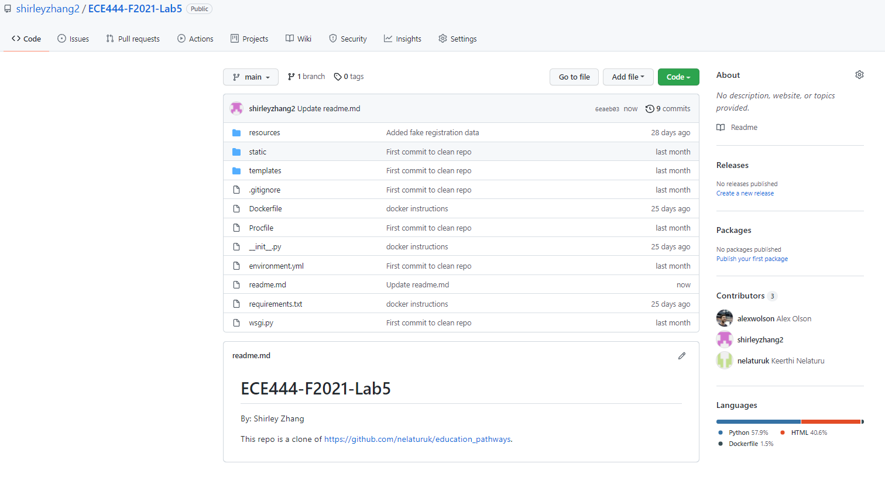
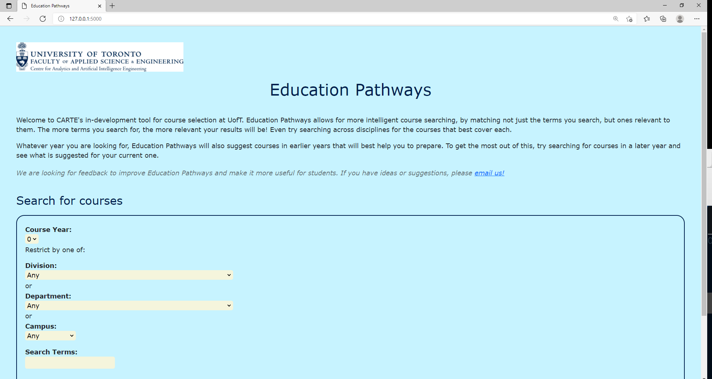
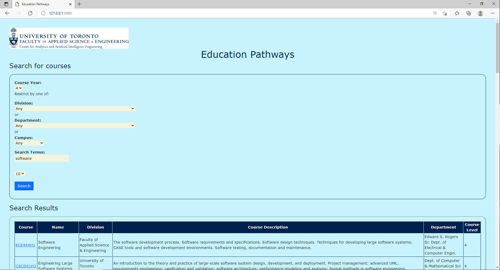
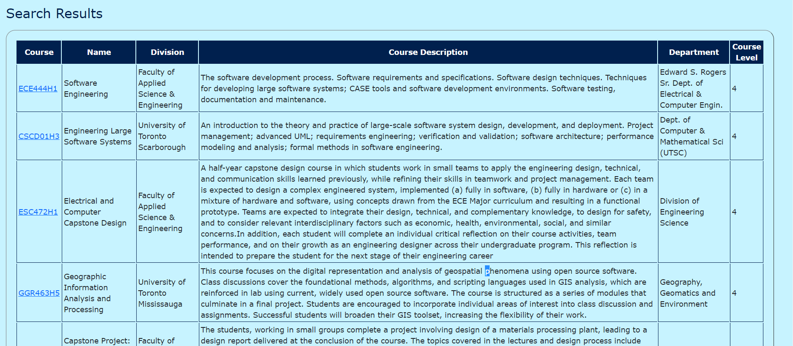

# ECE444-F2021-Lab5
By: Shirley Zhang

This repo is a clone of https://github.com/nelaturuk/education_pathways.

## Activity 1

## Activity 2-5

### Home Page

### Results Page – Form

### Results Page – Results Table

## Activity 6
The new UI uses different colors and font sizes to highlight different levels of information. The new UI also uses borders to separate different sections. In comparison, the old UI mostly uses the same colors and fonts throughout with minimal borders. As a result, the new UI is much more intuitive and is easier to navigate.